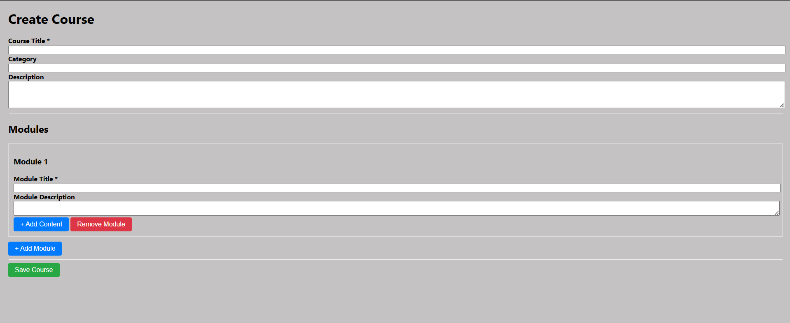
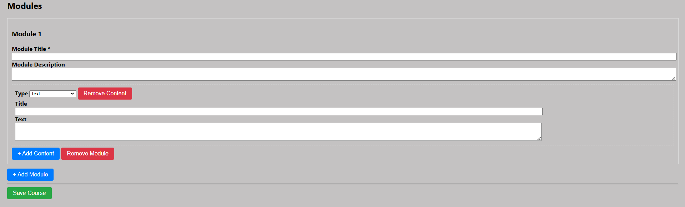
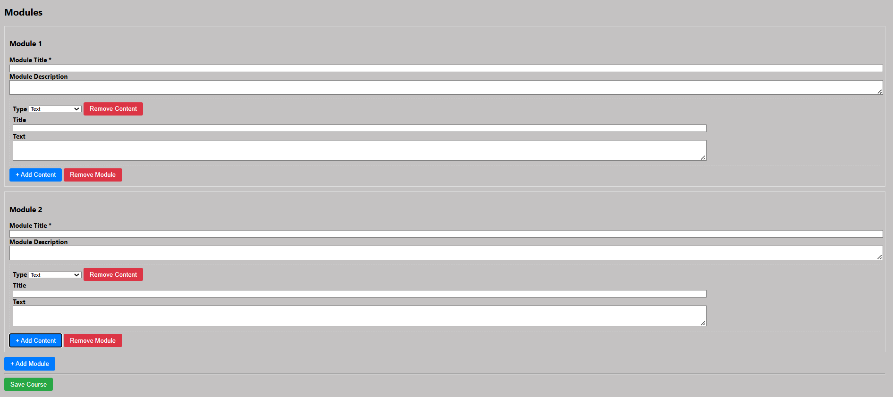
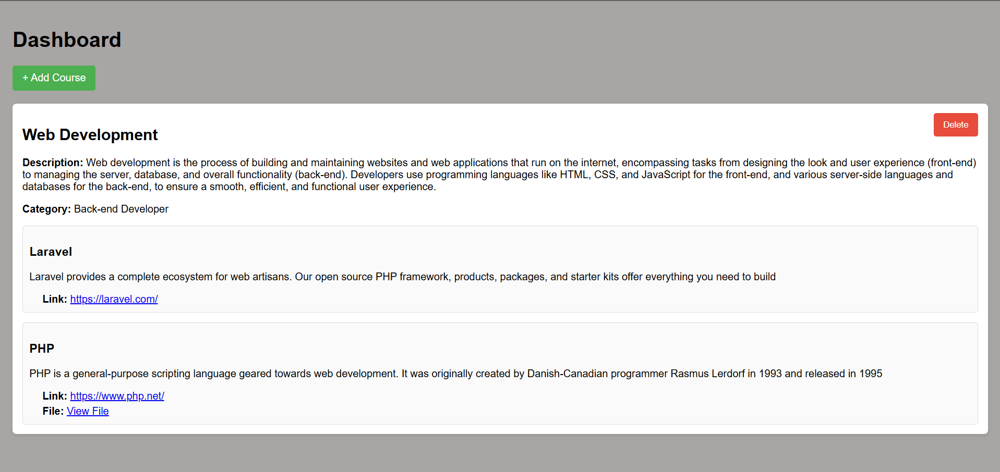

# Courses Manager

A Laravel-based web application to manage courses, modules, and contents. Users can create new courses (with title, description, category, etc.), see all existing courses in a dashboard, view associated modules & module contents (text, file, link), and delete courses via AJAX.

---

## 🧾 Features

- Create a course with modules and content (text, file upload, or external link).  
- Dashboard shows **all courses** with full details:  
  - Course title, description, category  
  - Associated modules + each module's contents  
- Delete any course via AJAX without page reload.  
- Simple layout using plain HTML + CSS + jQuery (no heavy front-end framework).  

---

## 🛠️ Tech Stack

- **Backend:** Laravel (PHP)  
- **Database:** MySQL  
- **Frontend:** HTML, CSS, jQuery  
- AJAX for delete operations  

---

## 🔍 Project Structure

```
/
├── app/
│   ├── Http/
│   │   ├── Controllers/
│   │   │   └── CourseController.php
│   └── Models/
│       └── Course.php (with relations to modules & contents)
├── resources/
│   ├── views/
│   │   ├── courses/
│   │   │   ├── create.blade.php
│   │   │   └── show.blade.php
│   └── … 
├── routes/
│   └── web.php
├── public/
└── README.md
```

- **CourseController** handles creating, listing, and deleting courses.  
- **show.blade.php** is used to list *all courses*.  
- **create.blade.php** is used to input new course data.

---

## ⚙️ Installation

1. Clone the repository:

   ```bash
   git clone <your-repo-url>
   cd <project-directory>
   ```

2. Install dependencies:

   ```bash
   composer install
   npm install  # if you are using any frontend build tools (optional)
   ```

3. Setup environment file:

   ```bash
   cp .env.example .env
   php artisan key:generate
   ```

4. Configure your database in `.env` file:

   ```
   DB_CONNECTION=mysql
   DB_HOST=127.0.0.1
   DB_PORT=3306
   DB_DATABASE=your_database
   DB_USERNAME=your_username
   DB_PASSWORD=your_password
   ```

5. Run migrations (if any) and seeders (if any):

   ```bash
   php artisan migrate
   ```

6. Serve the application:

   ```bash
   php artisan serve
   ```

   The app should be available at `http://127.0.0.1:8000` (or your configured port).

---

## 📋 Usage

- Navigate to **“All Courses”** to see all created courses.  
- Click **“Add Course”** to create a new course.  
- Each course card shows its modules and contents.  
- Use the **Delete** button on any course card to remove the course. A confirmation prompt appears and deletion is done via AJAX.

---

## 🔐 Notes & Possible Improvements

- CSRF tokens and authorization checks should be implemented for security.  
- File uploads should have size validation & storage handling.  
- The UI can be enhanced with better styles, responsive design.  
- Adding pagination or filtering/search on courses might help if there are many courses.  
- Possibly add edit/update functionality for courses and modules.

---

## 🤝 Contributions

Feel free to open pull requests or issues. Please follow coding conventions, include tests if possible, and ensure functionality works as expected.

---
Here is a screenshot:






